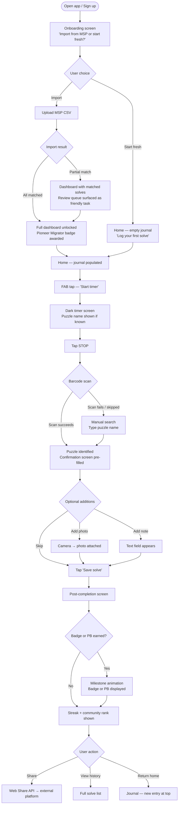
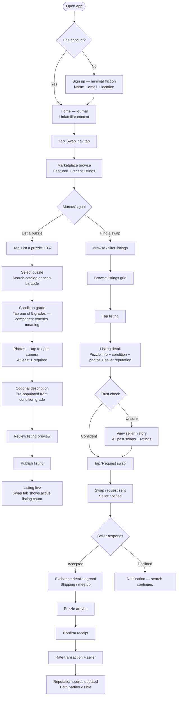
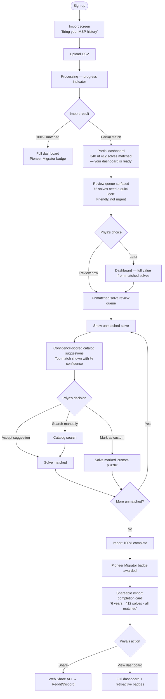

# UX Design Specification PuzzleTimesRecorder

**Author:** Andrew
**Date:** 2026-04-25

---

## Executive Summary

### Project Vision

PuzzleTimesRecorder is a mobile-first jigsaw puzzle tracking and community platform targeting the underserved speed puzzler cohort currently on myspeedpuzzling.com (MSP), while also capturing casual collectors through a trusted swap marketplace. The product competes on three axes MSP cannot address: a 3-tap mobile-first log flow designed for the moment of completion, a trusted peer-to-peer swap marketplace with reputation infrastructure, and MSP data portability that removes the sunk-cost switching barrier. The design language is warm, tactile, and cozy — evoking the physical pleasure of puzzling — but the visual register shifts by context: the timer screen and the browse experience feel intentionally different.

### Target Users

- **Emma (Speed Puzzler / MSP Migrator):** Competitive, mobile-first, couch puzzler. Wants 3-tap logging, rich personal analytics (streaks, PBs, trends), and a platform that makes her feel seen. The primary first-cohort acquisition target — but her switching trigger may be MSP's mobile absence as much as logging friction, and social network gravity on MSP is real.
- **Marcus (Casual Collector / Swap Seeker):** Relaxed puzzler primarily motivated by the marketplace. Has puzzles to offload; wants trusted, frictionless swap transactions. A net-new user type who would never have come from MSP — but is high-churn risk without a passive re-engagement loop and vulnerable to cold-start inventory problems.
- **Priya (Power User / Data-Rich Migrator):** Has years of solve history including messy, non-standard data. Tests the resilience of the import flow — but more importantly, is a likely distribution channel. She has community presence (Reddit, Discord, group chats). Designing her advocacy path (shareable import completion, easy referral) is as important as handling her messy data gracefully.
- **The Lapsed Puzzler (Emerging Archetype):** COVID-era puzzler with a collection, guilt about unused puzzles, and no logging habit. Not migrating from MSP — has never tracked anything. Acquisition-friendly but habit-fragile; onboarding must not assume prior logging behavior.

### Key Design Challenges

1. **The 3-tap log flow must be bulletproof — and the post-completion window must be designed.** The interaction is the switching trigger, but the five-minute window after completion is where retention lives. The user must feel seen, ranked, and eager to return — not just logged.
2. **Import onboarding must communicate partial progress as a win.** The unmatched solve review queue must feel like a friendly background task, not a blocker. Users get immediate value from matched solves while the queue waits.
3. **Two radically different archetypes in the same product.** Emma and Marcus have almost no overlapping primary motivations. The IA and post-login home experience must serve both without either feeling like they're in the wrong app — and Marcus needs a door that isn't the streak logger.
4. **Trust signals must be legible AND taught at first encounter.** Reputation scores and condition grading must convey confidence instantly on mobile — but new marketplace users need to build their mental model of the grading system through experience, not a tutorial modal. The first marketplace interaction is a teaching moment.
5. **The visual register shifts by context, not by brand.** Warm and cozy governs the completion moment, the passport, and the browse experience. Dense and fast governs the timer, analytics, and leaderboard. This is a context-switching design challenge, not a brand choice to make once.
6. **Marcus's cold-start inventory problem is a real risk.** If the marketplace has three listings on day one, Marcus bounces and never converts. The IA must not lead Marcus to an empty room — and seeding strategy must be reflected in the design.

### Design Opportunities

1. **The post-completion window as the primary retention surface.** The moment after a solve is logged — showing personal bests, streak progress, community rank, and a shareable result — is where emotional connection forms. This is more important than the log interaction itself.
2. **The Puzzle Passport as a social acquisition surface.** A beautifully designed, shareable user profile (textured, stamped, collectable) that functions as passive acquisition. When Priya or Emma screenshots and posts their stats, the Passport is what others discover.
3. **Priya's import completion as a designed advocacy moment.** A shareable "import complete" milestone — badge, summary card, referral prompt — turns a complex UX moment into a distribution event.
4. **Progressive import disclosure as a trust signal.** Showing partial import value immediately ("340 puzzles are already in your dashboard — 72 need a quick review") demonstrates platform competence and confidence. The review queue is friendly, not urgent.
5. **Identity-focused leaderboards.** Features like the Pioneer Migrator badge and Former Champion recognition signal that puzzle identity runs deeper than a rank. Leaderboard design should surface context and story, not just position.
6. **The marketplace listing as a teaching surface.** The first time Marcus browses a listing, the condition grading system should explain itself through the UI — not a tooltip, but through the design of the component itself (example conditions, visual language, seller history context).

---

## Core User Experience

### Defining Experience

The product has two parallel core loops:

- **Emma's loop:** Start timer → stop timer → identify puzzle (barcode scan or search) → save → post-completion moment (streaks, PBs, community rank, shareable result) → feel something → return tomorrow.
- **Marcus's loop:** Browse marketplace → evaluate listing (trust signals, condition, seller history) → request swap → confirm receipt → rate → reputation grows → list own puzzles.

The tap is not the product. The moment after the tap is the product. Every core interaction ends with a felt response — not a toast notification, but an acknowledgement that something meaningful just happened.

### Platform Strategy

- **PWA (SPA), mobile-first** — primary experience is a phone in hand; desktop is progressive enhancement
- **Minimum viewport:** 375px (iPhone SE); one-handed operation with primary actions within thumb reach on a 6" screen
- **Touch-first** — all interactions designed for tap, swipe, and one-handed use before mouse/keyboard
- **Offline-first** — Service Worker queues solve logs and syncs on reconnect; zero data loss is a V1 success criterion
- **Camera API** for barcode scan; immediate fallback to manual search on miss — never a dead end
- **PWA install prompt** surfaces after first solve log, not on first visit
- **No native app in V1** — PWA covers the acquisition case; revisit if adoption data demands it

### Effortless Interactions

These interactions must require zero conscious effort:

- **Barcode scan → puzzle identified** — no typing required; pre-fills solve confirmation screen
- **Timer start/stop** — single tap each; large touch target, impossible to miss
- **Solve confirmation** — pre-filled from scan, one tap to save; optional photo and note don't block the flow
- **Import** — upload CSV → immediate partial dashboard with matched solves; unmatched queue runs in background, never blocks
- **Swap listing creation** — photo + condition grade + description in under 2 minutes; condition grading is a tap, not a text field
- **Re-entry after absence** — app picks up where the user left off; no re-orientation required; streak shield absorbs the gap

### Critical Success Moments

| Moment | User | What must happen |
|---|---|---|
| First solve logged | Emma | Within 5 minutes of signup; activation event; triggers onboarding complete state |
| Post-completion screen | Emma | Streaks, PBs, community rank, and a shareable card appear immediately after save; this is where "better than MSP" is felt |
| First import batch matched | Priya | Partial dashboard appears immediately with matched solves; review queue is friendly and optional |
| Import milestone (100% match) | Priya | Pioneer Migrator badge + shareable summary card + referral prompt; designed advocacy moment |
| First swap confirmed | Marcus | Both parties rate each other; reputation score updates visibly; the trust system becomes tangibly real |
| First marketplace browse | Marcus | Condition grading communicates its meaning through visual design at first encounter — no tutorial required |

### Experience Principles

1. **The completion moment is the product.** Every core interaction ends with a moment of acknowledgement — not a toast notification, but a felt response. The solve screen, the import milestone, the swap confirmation: each earns its own choreography.

2. **Speed for the action, warmth for the result.** The log flow is fast and frictionless. The post-completion experience is warm and generous with information. These two registers co-exist within the same session — they don't compete.

3. **No empty rooms.** The IA accounts for users who arrive before the content does. Marcus on a cold marketplace, Emma on a fresh account — each gets something meaningful, not a placeholder. Progressive disclosure over dead ends.

4. **Trust is taught through design, not explained through text.** Condition grading, reputation scores, and swap history communicate their meaning through visual design at first encounter — not tooltips, modals, or onboarding flows.

5. **Interrupted use is the default, not the exception.** The design assumes users log two puzzles and disappear for three weeks. Re-entry must feel welcoming, not punishing. Streaks protect, history persists, the app picks up where the user left off.

6. **Advocacy is a designed output, not a side effect.** Shareable moments — the Puzzle Passport, the import completion card, the personal best record — are first-class design artifacts. Organic sharing is a primary acquisition channel.

---

## Desired Emotional Response

### Primary Emotional Goals

The platform should make users feel **seen, connected, and genuinely delighted** — not efficient or optimised. This is a product for people who love a slow, tactile, meditative hobby. The emotional register is cozy and warm, not clinical. The defining emotional test: does the user feel like the platform understands why they puzzle?

### Emotional Journey Mapping

| Stage | Target Emotion | Opposite to Avoid |
|---|---|---|
| First discovery / landing | Welcomed, unhurried, intrigued | Overwhelmed, confused |
| Onboarding / first solve | Capable, successful, quick | Intimidated, lost |
| Post-completion moment | Seen, proud, connected | Dismissed, empty |
| Import completion | Relieved, valued, capable | Blocked, frustrated |
| Marketplace browse | Curious, trusting, safe | Skeptical, uncertain |
| Swap confirmed | Warm satisfaction — like a physical handoff | Transactional, clinical |
| Returning after absence | Welcomed back, not punished | Guilty, behind |
| Badge / milestone unlock | Genuinely delighted — earned, not manipulated | Hollow, coerced |

### Micro-Emotions

- **Confidence over confusion** — especially in the marketplace; new users must never feel lost in the trust system
- **Earned delight over manufactured excitement** — gamification must feel celebratory, not manipulative
- **Belonging over isolation** — even solo puzzlers should feel part of a community
- **Warmth over efficiency** — efficiency is a means; warmth is the feeling

### Design Implications

| Emotion | UX Design Approach |
|---|---|
| Seen after a solve | Post-completion screen shows PB delta, streak status, community rank, and a shareable card — not just a "saved" confirmation |
| Earned delight on badges | Distinct animations per badge type referencing the physical puzzle experience; no generic confetti |
| Trust in the marketplace | Seller history and condition grading communicate confidence through component design; first encounter teaches without text |
| Welcomed on return | Streak shields absorb gaps; dashboard picks up where you left off; no "you've been inactive" messaging |
| Warm swap handoff | Completion screen uses language and design evoking a physical exchange, not a transaction receipt |
| Unhurried on first visit | Landing experience is calm, un-pushy; primary CTA is a solve, not a subscription |

### Emotional Design Principles

1. **Delight must be earned, not triggered.** Animations and celebrations respond to real milestones — not engagement-farming. A badge unlock feels different from a streak reminder.
2. **The post-completion moment is the emotional core.** More design attention belongs here than on the log interaction itself.
3. **Warmth and speed are not opposites.** The log flow can be fast; the result screen can be warm. They live in different registers within the same session.
4. **Absence is not failure.** The platform never makes users feel behind or guilty for stepping away. Streak shields, gentle re-entry, and persistent history make returning feel safe.
5. **Trust is felt before it is understood.** The marketplace must feel safe on first encounter — before the user has built any mental model of the reputation system.

---

## UX Pattern Analysis & Inspiration

### Inspiring Products Analysis

**Letterboxd — Community-first diary + social layer**
- Solves the "I want to remember what I watched and share my taste" problem with a UI that feels like a personal journal, not a database
- Onboarding is frictionless: log your first film before you finish signing up; value is immediate
- The diary entry is the atomic unit — date, film, rating, optional review — then social features layer on top without cluttering the core
- Profile pages feel like a curated identity, not a stats dump; lists and diary are first-class objects
- *Transferable:* Diary-first information architecture; profile as curated identity; log-first onboarding; community ratings as social proof on catalog pages

**Strava — Performance tracking with earned social rewards**
- The "activity complete" screen is the emotional peak of the product: map, time, elevation, segments, kudos from followers — all on one screen, immediately after saving
- Segment leaderboards give context to personal performance: "you're 3rd on this hill among your followers" is more motivating than a raw time
- Kudos is low-friction social acknowledgement — one tap, no comment required — and it drives return visits
- Error states and GPS issues are handled without drama; the app recovers gracefully and never loses data
- *Transferable:* Post-completion screen as the emotional peak; contextual leaderboard framing ("among friends," "in your category"); low-friction social acknowledgement; graceful data recovery

**Spotify — Personalisation through taste-graph + editorial seeding**
- Cold-start problem solved by editorial playlists that feel curated, not algorithmic, until the personal graph is rich enough
- "People who saved this also saved..." discovery is unobtrusive — it lives in context, not in a dedicated recommendation screen
- Wrapped / year-in-review is the platform's most-shared moment: personal data made beautiful and shareable
- *Transferable:* Editorial seeding for cold-start recommendations; in-context discovery; annual data summary as a designed sharing moment (equivalent: Puzzle Year in Review)

**chess.com — Performance coaching with progressive complexity**
- Post-game analysis gates behind minimum game count — it gets better as you play more, and the platform tells you this honestly
- Accuracy score and "best move" overlays teach without lecturing
- Rating system is visible everywhere but explained contextually on first encounter — not in a tutorial
- *Transferable:* Honest cold-start messaging for AI coach; performance coaching that shows, doesn't lecture; trust metrics explained contextually at first encounter

**Physical passport / stamp book — Tactile collection identity**
- A passport is a record of experiences, not a leaderboard; each stamp is earned and permanent
- Collection is the point — the goal is to fill it, not to optimise it
- *Transferable:* Puzzle Passport as a record of experiences; badges as permanent stamps, not notifications; the profile should feel like something worth filling

### Transferable UX Patterns

**Navigation Patterns:**
- **Diary-first IA (Letterboxd)** — the solve entry is the atomic unit; all other features are accessed from there or from persistent nav, never buried
- **Activity feed as social glue (Strava)** — a lightweight feed of friends' recent solves drives return visits and creates belonging without requiring active participation

**Interaction Patterns:**
- **Post-completion screen as emotional peak (Strava)** — one screen, immediately after save, with everything the user wants: time, PB delta, streak, community rank, shareable card
- **Low-friction social acknowledgement (Strava kudos)** — one-tap "nice solve" on friend activity; drives return visits without requiring a comment
- **Contextual first-encounter explanation (chess.com)** — trust metrics and condition grades explain themselves through design at first encounter; no tooltip, no tutorial modal
- **Editorial seeding for cold-start (Spotify)** — curated staff picks and brand/theme collections fill the marketplace before the user graph is rich enough to personalise
- **Honest capability messaging (chess.com)** — AI coach gates behind minimum solve count with transparent messaging: "your coach is learning alongside you"

**Visual Patterns:**
- **Profile as curated identity (Letterboxd)** — the Puzzle Passport is a record of experiences and earned stamps, not a stat dashboard
- **Shareable data moments (Spotify Wrapped)** — milestone summaries made beautiful and export-ready; Puzzle Year in Review as a designed sharing event
- **Contextual leaderboard framing (Strava)** — "2nd among people who've solved this puzzle" is more motivating than a global rank of 847

### Anti-Patterns to Avoid

- **MSP's cluttered desktop IA on mobile** — information hierarchy designed for a large screen, pinch-zoomed onto a phone
- **Generic confetti / toast notifications for milestones** — badge unlocks that feel like system alerts rather than earned celebrations
- **Tutorial modals for trust systems** — explaining condition grading in a modal before the user has seen a listing; teach through design at first encounter instead
- **Blocking on import completion** — requiring 100% match before showing any dashboard value; partial progress must unlock immediate reward
- **Dark patterns in premium upgrade flow** — urgency, guilt, or anxiety around streak loss before streak shields are surfaced
- **Efficiency-first language in completion moments** — "Solve logged." as a confirmation is the opposite of the emotional register we're targeting
- **Global leaderboards without context** — a raw rank of 4,382 is demotivating; "top 12% for 1000-piece puzzles" is motivating

### Design Inspiration Strategy

**Adopt directly:**
- Letterboxd's log-first onboarding and diary-first IA
- Strava's post-completion screen structure (everything the user wants, one screen, immediately after save)
- chess.com's contextual first-encounter explanation for trust metrics and grading
- Spotify's editorial seeding pattern for cold-start marketplace and catalog

**Adapt for our context:**
- Strava kudos → lightweight "nice solve" acknowledgement on friend activity feed
- Spotify Wrapped → Puzzle Year in Review (annual shareable summary card)
- chess.com post-game analysis → AI Performance Coach (gated behind 20 solves with honest cold-start messaging)
- Physical passport aesthetic → Puzzle Passport profile (digital shareable artifact with tactile visual language)

**Avoid entirely:**
- Any navigation pattern that puts logging more than one tap from the home screen
- Any completion confirmation that reads as a system message rather than an acknowledgement
- Any marketplace trust system that requires a tutorial before it communicates meaning

---

## Design System Foundation

### Design System Choice

**Tailwind CSS + shadcn/ui** (Themeable System), with Framer Motion for animation.

### Rationale for Selection

- **Solo/small team with a proven-stack mandate** — Tailwind + shadcn/ui is the established standard for Next.js projects; strong ecosystem, documentation, and community support minimise maintenance burden
- **Full visual control without fighting the framework** — Tailwind utility classes give complete design freedom; the warm, cozy visual language won't be constrained by pre-baked component aesthetics
- **Accessibility built into the primitive layer** — shadcn/ui is built on Radix UI primitives, which handle WCAG 2.1 AA compliance (keyboard navigation, ARIA, focus management) at the component level
- **Custom components slot in naturally** — the Puzzle Passport, post-completion screen, badge animations, and marketplace listing card are fully bespoke; they work alongside shadcn primitives without impedance mismatch
- **Design tokens propagate from one source** — Tailwind config defines the color palette, typography scale, and spacing system; RTL support and i18n layout can be architected from day one

### Implementation Approach

- **Foundation components** (buttons, forms, modals, dropdowns, inputs): shadcn/ui primitives, fully themed via Tailwind config
- **Core custom components** (timer screen, post-completion screen, Puzzle Passport, badge system, marketplace listing card): built with Tailwind utilities; these are the product's signature interactions and warrant bespoke treatment
- **Animation layer**: Framer Motion for micro-animations on badge unlocks, completion moments, streak milestones, and swap confirmations; kept purposeful and distinct per interaction type
- **Design tokens**: defined in `tailwind.config` — color palette, typography scale, spacing, border radius, shadow system; all theming changes flow from this single source

### Customization Strategy

- Override shadcn/ui component styles via Tailwind class variants — no CSS-in-JS, no specificity battles
- Establish a warm color palette as the base token set: earthy neutrals, a single warm accent color, and semantic tokens for states that feel cozy rather than clinical
- Define a typography scale with a humanist sans-serif for UI and a display face for the Puzzle Passport and completion moment headings
- Bespoke animation tokens: duration, easing curves, and delay values defined as Tailwind custom values so all animations share a consistent feel
- Dark mode deferred to V1.5 — architecture accommodates it (Tailwind's `dark:` variant) but visual design ships in light mode only at launch

---

## Defining Core Experience

### Defining Experience

> "Finish your puzzle, tap three times, feel seen."

The defining experience is logging a completed solve in 3 taps and landing on a screen that makes the completion feel real. This is the sentence Emma tells her friend. It is the interaction that is impossible on MSP and the reason the first cohort switches.

**The one-line description users will use:** "You finish the puzzle, scan the box, and it just knows."

### User Mental Model

Users arrive with one of two mental models:

- **MSP migrators (Emma):** Logging a solve means navigating a multi-step desktop form, pinching and zooming on mobile, filling in time manually, and submitting through multiple screens. The expectation: *anything faster and more mobile-native is better.*
- **Non-trackers (Marcus, lapsed puzzlers):** Logging means writing it down — or not at all. The expectation: *this should be as simple as making a note.*

Both mental models set the same bar: **zero friction at the moment of completion.** The barcode scan is the moment the product exceeds both expectations — the puzzle identifies itself. The user doesn't need to search, type, or remember the name.

The post-completion screen expectation is borrowed from fitness apps (Strava, Garmin): immediately after finishing, I see how I did. I don't navigate to find it. It's waiting for me.

### Success Criteria

The core log interaction succeeds when:

- The full flow (timer stop → puzzle identified → solve saved) completes in **≤ 3 taps**
- Barcode scan resolves to the correct puzzle in **≤ 1.5 seconds**; manual search is one tap away and never a dead end
- The post-completion screen appears **immediately after save** with no additional navigation
- The interaction works **one-handed** on a 6" screen with all primary touch targets ≥ 44×44px
- The flow works **offline** — solve queues locally and syncs on reconnect with zero data loss
- First-time users complete their first solve log **within 5 minutes of signup**
- Users describe the experience as "fast" and "it just knew" — not "easy to figure out"

### Novel UX Patterns

**Established patterns used:**
- Timer start/stop (single tap — universal)
- Camera barcode scan (familiar from retail/inventory apps)
- Form confirmation with pre-filled fields (familiar from e-commerce checkout)
- Activity complete screen (established by Strava/fitness apps)

**Novel combination:**
The novelty is not the individual interactions but the choreography: all steps are sequenced for one-handed mobile use at the moment of highest motivation (puzzle just completed), with barcode scan eliminating the manual identification step that MSP requires. The result feels faster than any comparable flow because it is — not through novel interaction design, but through elimination of steps.

**The post-completion screen** is novel for puzzling but an established pattern from fitness apps. No user education required — the pattern is already in users' muscle memory from Strava, Garmin, and Nike Run Club.

### Experience Mechanics

**Initiation:**
- Primary entry: floating action button (FAB) on the home screen — one tap, always reachable, always visible
- Secondary entry: "Start Timer" from a puzzle's detail page (for users who identify the puzzle first)
- Timer starts immediately on tap — no confirmation, no intermediate screen

**Interaction:**
- Timer runs on a dedicated, distraction-free screen: large time display, single "Stop" tap to complete
- On stop: camera viewfinder opens immediately for barcode scan (or "Search manually" tap below)
- Barcode resolves to puzzle name + image; user confirms or corrects (one tap to confirm, keyboard appears only if correction needed)
- Optional: photo attachment (one tap to open camera) and personal note (collapsed by default) — neither blocks the save
- "Save solve" — one tap

**Feedback:**
- Barcode scan: haptic feedback + visual highlight on successful read (< 1.5s)
- Save: brief transition animation into the post-completion screen (felt as instant, not a loading state)
- Post-completion screen: PB delta, streak status, community rank in category, and a shareable card — all visible without scrolling on a standard mobile screen

**Completion:**
- Post-completion screen is the destination — not a modal, not a toast, not a redirect to home
- From here: share (Web Share API), view full puzzle history, or return home (swipe down or back)
- Streak and badge unlocks surface here if earned — with distinct animation, not a notification badge

---

## Visual Design Foundation

### Color System

Built on warm parchment neutrals with terracotta as the primary accent and sage as a secondary supporting tone — evoking warm lamplight, wooden tables, and the physical pleasure of puzzling rather than a tech product aesthetic.

**Core Tokens:**

| Token | Value | Usage |
|---|---|---|
| `--color-base` | `#FAF7F2` | App background — warm off-white |
| `--color-surface` | `#FFFFFF` | Cards, modals, elevated surfaces |
| `--color-surface-raised` | `#F5F0E8` | Secondary cards, input backgrounds |
| `--color-primary` | `#C4603A` | Primary actions, FAB, active states |
| `--color-primary-light` | `#E8B5A0` | Hover states, soft highlights |
| `--color-primary-subtle` | `#FAF0EB` | Badge backgrounds, soft call-outs |
| `--color-secondary` | `#6B8F71` | Secondary actions, success, streaks |
| `--color-secondary-subtle` | `#EEF4EF` | Success backgrounds, streak shields |
| `--color-text-primary` | `#1C1917` | Body text |
| `--color-text-secondary` | `#78716C` | Secondary labels, metadata |
| `--color-border` | `#E7E0D8` | Card borders, dividers |
| `--color-warning` | `#D97706` | Streak at-risk, warnings |
| `--color-error` | `#B91C1C` | Errors, destructive actions |

**Semantic mappings:** Completion/celebration → primary (terracotta); streaks/progress → secondary (sage); marketplace trust high → secondary; trust low → warning/error; badge unlocks → primary-subtle background + primary accent.

**Contrast compliance (WCAG 2.1 AA):** warm-ink on parchment 16.8:1 (AAA); terracotta on parchment 4.6:1 (AA); warm-gray on parchment 4.8:1 (AA).

### Typography System

**UI Typeface: Plus Jakarta Sans** — humanist geometric sans-serif; friendly, highly legible on mobile; used for all body copy, labels, navigation, forms, buttons.

**Display Typeface: Fraunces** — warm variable serif with optical sizing and strong personality; used for Puzzle Passport headings, post-completion PB display, badge names, and marketing headings.

**Type Scale (mobile-first, 16px base):**

| Token | Size | Weight | Typeface | Usage |
|---|---|---|---|---|
| `display-lg` | 48px | 700 | Fraunces | Post-completion PB time, Passport hero |
| `display-sm` | 32px | 700 | Fraunces | Section heroes, badge name |
| `heading-1` | 24px | 700 | Plus Jakarta Sans | Page titles |
| `heading-2` | 20px | 600 | Plus Jakarta Sans | Section headings |
| `heading-3` | 17px | 600 | Plus Jakarta Sans | Card headings |
| `body-lg` | 16px | 400 | Plus Jakarta Sans | Primary body copy |
| `body-sm` | 14px | 400 | Plus Jakarta Sans | Secondary copy, descriptions |
| `label` | 13px | 500 | Plus Jakarta Sans | Metadata, tags, condition grades |
| `caption` | 12px | 400 | Plus Jakarta Sans | Timestamps, fine print |

Line height: 1.5 for body, 1.2 for display/headings. Letter-spacing: -0.01em for headings, 0 for body.

### Spacing & Layout Foundation

**Base unit: 4px.** All spacing values are multiples of 4.

Standard spacing tokens: 4px (tight), 8px (close), 12px (related), 16px (standard padding), 20px (between components), 24px (section, mobile), 32px (section, desktop), 48px (major breaks).

**Layout feel:** Airy but purposeful. Cards have 16–20px internal padding. The timer screen is deliberately minimal: large time display, single action, nothing else competing for attention.

**Mobile grid:** Single column, 16px horizontal margin. Max content width: 428px. Cards span full width within margins.

**Desktop grid:** Centered, max-width 680px for content, 960px for data-heavy views (leaderboards, catalog). Two-column marketplace grid at ≥ 768px.

### Accessibility Considerations

- All touch targets ≥ 44×44px; primary actions (FAB, timer stop, save) ≥ 56×56px
- Color is never the sole means of communicating state — condition grades and trust signals use color + label + icon
- All contrast ratios meet WCAG 2.1 AA minimum; primary text pairs meet AAA
- RTL layout support architected from day one in Tailwind config — not activated at launch but requires no rework to enable
- Focus indicators: visible, high-contrast ring on all interactive elements (Tailwind's `focus-visible:ring` pattern)

---

## Design Direction Decision

### Design Directions Explored

Six directions were generated and evaluated as interactive HTML mockups (`ux-design-directions.html`), each applying the established color system (terracotta/parchment/sage) and typography (Plus Jakarta Sans + Fraunces) to a different home screen IA:

| # | Direction | Home hero |
|---|---|---|
| 01 | Warm Journal | Diary-first dated entries with Fraunces editorial headings |
| 02 | Activity Dashboard | Stats header, streak metrics, quick log CTA |
| 03 | Cozy Collection | Visual puzzle grid / shelf aesthetic |
| 04 | Minimal Timer | Dark, distraction-free timer screen (screen state, not home) |
| 05 | Social Feed | Friend activity and community-first home |
| 06 | Passport Identity | Earned badges and profile as the home hero |

### Chosen Direction

**Primary home IA: Direction 02 — Activity Dashboard**, with **Direction 04 — Minimal Timer** as the active logging screen state, **Direction 06 — Passport Identity** elements powering the Profile tab, and **Direction 01 — Warm Journal** influencing the solve history / recent activity section beneath the stats header.

### Design Rationale

- **Activity Dashboard (02)** best serves Emma's primary motivation — she's a competitive speed puzzler. Landing on her streak count, global rank, and a prominent "Start a solve" CTA is more motivating than a chronological diary. The terracotta header creates strong visual identity and immediate orientation. Stats at a glance is the right first-screen experience for the first-cohort user.
- **Warm Journal (01)** elements are incorporated beneath the dashboard header — the recent solves section uses the diary-entry aesthetic (Fraunces time display, dated entries) so the warmth and editorial quality are preserved without being the primary IA.
- **Minimal Timer (04)** as the active logging state creates a deliberate tonal shift — the app drops into a focused, dark, distraction-free mode the moment a solve begins. This context shift (dashboard home → dark focused timer → warm completion screen) maps to the emotional journey: measure/motivate → concentrate → feel seen.
- **Passport Identity (06)** as the Profile tab gives Priya and Emma a shareable, stamp-book-style artifact that functions as the product's organic acquisition surface.
- **Direction 05 (Social Feed)** was ruled out as a home screen due to cold-start inventory risk — an empty feed on day one is the worst first impression for a new platform.

### Implementation Approach

- **Home tab:** Stats header (terracotta, streak + solve count + rank), prominent "Start a solve" CTA card, recent solves section using Warm Journal entry aesthetic below; FAB always accessible
- **Active solve state:** Full-screen dark timer overlay (Direction 04 aesthetic) — persists across navigation; cannot be accidentally dismissed
- **Post-completion screen:** Warm, full-screen result view with PB delta, streak, community rank, and shareable card; new solve appears at top of home recent solves on return
- **Profile tab:** Puzzle Passport layout with earned badges as stamps, solve stats, and share affordance
- **Marketplace tab:** Distinct browse-first layout — serves Marcus's mental model independently

---

## User Journey Flows

### Journey 1: Emma — MSP Migrator (3-tap log + onboarding)

**Entry point:** Discovers the platform via Reddit/Discord, signs up on mobile.

**Critical design notes:**
- Import partial match shows dashboard immediately — user is not blocked on resolving the queue
- Timer screen is full-screen dark overlay — persists if user accidentally navigates; confirm-to-cancel required
- Post-completion screen is the destination, not a redirect; badge animations play before stats appear
- "Save solve" is never disabled — optional fields do not gate the primary action

---

### Journey 2: Marcus — Swap Seeker (marketplace listing + transaction)

**Entry point:** Finds the platform searching for "puzzle swap"; primary motivation is marketplace, not logging.

**Critical design notes:**
- Condition grade component is the first marketplace-trust teaching moment — 5 grades with visual examples baked into the selector, no modal explanation
- Cold-start state: if marketplace has <20 listings, show curated "Staff picks" and category collections instead of a sparse grid
- Listing creation capped at 2 minutes; photos required (trust signal) but camera opens in one tap

---

### Journey 3: Priya — Partial Import Recovery (progressive resolution)

**Entry point:** Exports MSP CSV; has 6 years of history with non-standard puzzle titles.

**Critical design notes:**
- "72 solves need a quick look" — language is deliberately low-stakes; never "72 errors" or "import incomplete"
- Batch resolve flows like a card stack — no returning to a menu between resolutions
- Retroactive badges awarded as each solve resolves — micro-celebration at each step, not just at 100%
- Import completion card is a first-class shareable artifact: puzzle count, year range, solve count, Pioneer Migrator badge

---

### Journey Patterns

**Navigation patterns:**
- **FAB as universal entry to logging** — always visible, one tap from any tab
- **Tab bar: Home / Catalog / [FAB] / Swap / Profile** — five-item with centred FAB
- **Full-screen overlays for focused tasks** — timer, barcode scan, import, and post-completion each suppress navigation

**Decision patterns:**
- **Pre-fill over empty fields** — every form defaults to the most likely value; user confirms or overrides
- **Confidence scoring on ambiguous matches** — fuzzy matches show % confidence for informed accept/reject
- **Progressive commitment** — optional fields are collapsed by default; never gate the primary action

**Feedback patterns:**
- **Immediate partial value** — no full-screen loading states; value appears as soon as it's available
- **Milestone animations before stats** — emotional beat lands before the data on post-completion screen
- **Error as information, not failure** — unmatched solves, barcode misses, and swap declines are framed as next steps

### Flow Optimization Principles

1. **Every primary action is one tap from anywhere.** Log (FAB), swap tab, catalog tab — never more than one tap from the current screen.
2. **Optional never gates required.** Photos, notes, descriptions — none block the primary save/publish action.
3. **Recovery is designed, not bolted on.** Barcode miss → manual search. Import partial → review queue. Swap declined → search continues.
4. **Partial completion delivers full emotional value.** Matched solves unlock the dashboard immediately; value is front-loaded, not held hostage to completion.
5. **Shareable moments are always one tap away.** Post-completion screen, import completion card, Puzzle Passport — share affordance in the primary action zone.

---

## Component Strategy

### Design System Components (shadcn/ui)

Used as-is, themed via Tailwind config — no custom implementation needed:

- **Button** — primary (terracotta), secondary (outlined), ghost, destructive variants
- **Input / Textarea** — solve notes, search, listing description
- **Select / Dropdown Menu** — filters, sort controls, settings
- **Dialog / Sheet** — modals (desktop), bottom drawers (mobile)
- **Tabs** — Collection (Solved / Owned / Wishlist), Admin views
- **Badge** — condition grade labels, status chips
- **Avatar** — user profile images with fallback initials
- **Card** — solve rows, marketplace listing cards, catalog entries
- **Progress** — import completion bar, goal progress meter
- **Skeleton** — loading states for feed, catalog, and marketplace
- **Toast** — non-critical notifications (follow added, listing saved)
- **Command** — puzzle catalog search palette (barcode fallback + manual)
- **Form + validation** — listing creation, account settings, import review

### Custom Components

Eight bespoke components that define the product's signature interactions:

---

#### 1. TimerScreen
**Purpose:** Full-screen focused solve timer — the core logging interaction.
**Content:** Elapsed time (Fraunces display-lg), puzzle name + piece count (if known), PB reference time.
**Actions:** Stop timer (80×80px circular button); cancel solve (requires confirmation sheet to prevent accidental exit).
**States:** Running (dark background, time counting), Stopping (brief freeze animation → transition to SolveConfirmation).
**Variants:** Pre-identified (puzzle name shown) vs. anonymous ("Solving..." until barcode resolved).
**Accessibility:** Timer value announced to screen readers every 30 seconds; Stop button `aria-label="Stop timer"`.
**Interaction:** Stop tap → haptic + visual pulse → transition to SolveConfirmation. Back/swipe-down opens cancel confirmation.

---

#### 2. SolveConfirmation
**Purpose:** Pre-save confirmation screen — puzzle identification + optional enrichment before saving.
**Content:** Detected/selected puzzle name + image, recorded time, optional photo attachment, optional personal note.
**Actions:** Confirm puzzle (pre-filled from barcode; editable), attach photo, add note, Save solve (primary CTA — never disabled).
**States:** Barcode-matched (pre-filled, one-tap save), Manual (search field active), Photo attached, Note added, Offline (photo deferred, sync indicator shown).
**Accessibility:** "Save solve" is always the first focusable element after puzzle name confirmation.

---

#### 3. PostCompletionScreen
**Purpose:** The emotional peak after a solve — makes completion feel real and earned.
**Content:** Puzzle name + time (Fraunces display-lg), PB delta, streak status, community rank in category, shareable card thumbnail.
**Actions:** Share (Web Share API), View full history, Return home (swipe down).
**States:** New PB (terracotta celebration animation first), Badge unlocked (stamp animation), Streak milestone (flame animation), Standard (stats shown immediately), First solve ever (encouraging copy, no PB context).
**Accessibility:** Animations respect `prefers-reduced-motion`; stats announced after animation completes.
**Interaction:** Badge/PB animation plays 1.5–2s before stats appear; cannot be dismissed during animation.

---

#### 4. ConditionGradeSelector
**Purpose:** Teaches the swap marketplace trust system at first encounter through design — no tutorial modal required.
**Content:** 5 grade options (Excellent / Very Good / Good / Fair / Poor), each with colour indicator, one-line description, and example condition note. Selection pre-populates listing description template.
**States:** Unselected, Selected (chosen highlighted, others dimmed), Error (no grade on submit attempt).
**Accessibility:** Radio group with full label text per grade; keyboard navigable.

---

#### 5. ReputationBadge
**Purpose:** Communicates seller/buyer trust at a glance on mobile.
**Content:** Numeric score, star visual, swap count, optional "Verified" indicator.
**Actions:** Tap → expands to full swap history sheet.
**States:** High trust (≥4.0, sage), Medium trust (3.0–3.9, neutral), Low trust (<3.0, warning amber), New trader (no score shown — "New trader" label, never "0 swaps").
**Accessibility:** Score announced as "4.8 out of 5, 12 completed swaps".

---

#### 6. PuzzlePassportCard
**Purpose:** Shareable profile identity artifact — the product's organic acquisition surface.
**Content:** Display name (Fraunces), avatar, solve count, streak, global rank, top 8 badge stamps, Pioneer Migrator status.
**Actions:** Share (Web Share API generates image), Expand (opens Profile tab).
**Variants:** Compact (post-completion share preview), Full (Profile tab hero).
**States:** Full (all stats), Partial (new user — encourage first solve), Pioneer (distinct visual treatment).
**Accessibility:** Shared image includes alt text describing stats.

---

#### 7. ImportReviewCard
**Purpose:** Unmatched solve review queue — resolves import gaps without feeling like homework.
**Content:** Original MSP title + time + date, top catalog suggestion with confidence %, puzzle image, alternative suggestions (collapsed).
**Actions:** Accept top suggestion (primary), Search manually (Command palette), Mark as custom, Skip for now.
**States:** High confidence (≥80%, accept is clearly right), Low confidence (<80%, caution shown), No match (search prompt is primary).
**Interaction:** Resolving one card advances automatically to next — card-stack flow, no menu return.
**Accessibility:** Each card is a labelled radio form group.

---

#### 8. SolveJournalEntry
**Purpose:** The atomic unit of the Warm Journal home screen.
**Content:** Date marker (Fraunces day numeral), puzzle name, recorded time (Fraunces heading), piece count, PB indicator, photo thumbnail (if attached), note preview (if added).
**Actions:** Tap → Solve detail view; long-press → quick actions (share, edit note, delete).
**States:** Standard, Personal best (terracotta PB marker), Has photo, Has note, Today's entry (slightly elevated).
**Accessibility:** Full accessible label: "[Puzzle name], [time], [piece count], [date]".

---

### Component Implementation Strategy

- All custom components built with Tailwind utility classes — no CSS-in-JS
- Custom components consume the same design tokens as shadcn/ui (colours, spacing, typography via Tailwind config) — consistency enforced at the token level
- Framer Motion handles all animation (PostCompletionScreen, TimerScreen transitions, ImportReviewCard stack) — animation tokens shared across all components
- Server-component-compatible where possible; client components only where interactivity requires (TimerScreen, PostCompletionScreen, ConditionGradeSelector)

### Implementation Roadmap

**Phase 1 — V1 critical path:**
TimerScreen, SolveConfirmation, PostCompletionScreen, SolveJournalEntry, ConditionGradeSelector, ImportReviewCard

**Phase 2 — V1 supporting:**
ReputationBadge, PuzzlePassportCard

**Phase 3 — V1.5:**
AI Coach result card, Recommendation card, Contest/Puzzle of the Week card

---

## UX Consistency Patterns

### Button Hierarchy

**Primary action** (terracotta, filled): One per screen maximum — "Save solve", "Publish listing", "Accept suggestion", "Request swap". Full-width on mobile.

**Secondary action** (outlined, terracotta border): Legitimate alternatives — "Search manually", "Add photo", "Skip for now". Never compete visually with primary.

**Ghost / text action** (no border, terracotta text): Lowest-stakes — "Cancel", "Do this later", "View full history". Placed away from primary to prevent accidental taps.

**Destructive action** (clay red, outlined): Delete, remove, cancel subscription. Always requires a confirmation sheet before executing — never a single tap.

**FAB:** Reserved exclusively for "Start timer / Log a solve". Terracotta, 52×52px, centred above tab bar. Never used for anything else.

**Mobile rule:** All buttons minimum 44px height; primary 52px; FAB 52×52px. Primary action always at the bottom within thumb reach.

### Feedback Patterns

**Success (non-critical):** Toast at top of screen, auto-dismisses after 3s. Active voice, past tense ("Listing published", "Note saved").

**Success (milestone):** PostCompletionScreen or ImportReviewCard animation — full choreographed response. Never a toast for solve saves, badges, PBs, or import completion.

**Error (recoverable):** Inline below the affected field in clay red. Plain language, no error codes. Always includes the recovery path ("Barcode not recognised — [Search manually]"). Never blocks the primary action if avoidable.

**Error (blocking):** Full-width alert card above the primary action. Offers the offline alternative where available.

**Warning:** Amber inline alert. Used for: streak at risk, free-tier listing limit approaching, import queue pending.

**Empty state:** Never a blank screen. Every empty state: warm illustration, one-sentence explanation, primary action. Avoid "No results found" — use "You haven't logged any solves yet — [Start your first]".

**Loading state:** Skeleton screens for content lists. Spinner only for point operations. Never a full-screen loading overlay for progressively-revealable content.

### Form Patterns

**Pre-fill over empty:** Every field defaults to the most likely value. Barcode scan pre-fills puzzle name. Condition grade pre-fills description template. User confirms or overrides.

**Progressive disclosure:** Optional fields collapsed by default, revealed by single tap. Optional fields never gate the primary action.

**Validation timing:** Validate on blur, not on keystroke. Error messages appear inline below the field, not in a modal.

**Keyboard behaviour (mobile):** Primary action button remains visible above the keyboard at all times.

**Confirmation before destructive action:** Bottom sheet only — action summary, consequence, destructive confirm (red), cancel (ghost). No "are you sure?" modals.

### Navigation Patterns

**Tab bar:** Home / Catalog / [FAB] / Swap / Profile. Active: terracotta. Tab labels always visible — no icon-only tabs.

**Bottom sheets:** Used for contextual actions (cancel confirmation, quick actions, filter panels, reputation expansion). Never full-screen modals for these.

**Full-screen overlays:** TimerScreen, barcode scan, SolveConfirmation, PostCompletionScreen, import processing. Suppress tab bar and header. Exit requires explicit action.

**Deep links:** Puzzle catalog pages, user profiles, and marketplace listings are all deep-linkable for sharing. Authenticated views redirect to login with return URL preserved.

### Empty States & Loading

- **Journal (no solves):** Warm illustration + "Your puzzle journey starts here." + "Start timer" CTA
- **Marketplace (cold start):** Editorial "Staff picks" grid — never shown as empty
- **Catalog search (no results):** Two recovery paths — "Add it to the catalog" or "Search differently"
- **Import queue (complete):** Replaced by Pioneer Migrator badge + completion card — queue disappears, replaced by positive state
- **Activity feed (no follows):** "Follow other puzzlers to see their solves here. [Explore community]"

### Search & Filtering

**Puzzle catalog search:** Command-palette pattern — full-screen overlay, instant results (debounced 200ms). No results → "Add this puzzle" CTA.

**Marketplace filters:** Bottom sheet panel. Filters: title, condition grade (chips), piece count (slider), location radius. Active filter count on button ("Filters · 2"). Clear all in one tap.

**Sort controls:** Dropdown anchored to "Sort" label with selected option shown inline ("Sort: Recent").

**Search persistence:** Queries and active filters persist within a session; reset on tab switch.

---

## Responsive Design & Accessibility

### Responsive Strategy

**Philosophy: Mobile-first, desktop as progressive enhancement.** Every design decision starts at 375px and scales up. Desktop is a wider, less constrained version of the same IA — not a separate design.

**Mobile (375px–767px) — Primary experience:**
- Single-column layout, 16px horizontal margin
- Tab bar navigation with centred FAB
- Full-screen overlays for focused tasks (timer, barcode, post-completion)
- Bottom sheets for contextual actions (filters, confirmations, reputation expansion)
- Touch targets ≥ 44×44px; primary actions ≥ 52×52px
- One-handed operation: primary actions within thumb reach on 6" screens

**Tablet (768px–1023px) — Enhanced touch experience:**
- Marketplace and catalog browse switch to 2-column grids
- Bottom sheets expand to wider drawers
- Tab bar retained (not replaced with sidebar)
- Touch-optimised — no hover-dependent interactions
- Solve journal remains single-column (diary feel preserved)

**Desktop (1024px+) — Progressive enhancement:**
- Content max-width: 680px centred for journal, profile, and single-column views
- Data-heavy views (leaderboards, catalog, marketplace): max-width 960px, 2–3 column grid
- Sidebar navigation replaces tab bar at ≥ 1024px (left-anchored, persistent)
- Hover states on interactive elements; keyboard shortcuts for power users
- Marketplace listings: 3-column grid
- No new features introduced at desktop — all features available at mobile; desktop adds density and efficiency

### Breakpoint Strategy

Using Tailwind's default breakpoint system (mobile-first):

| Breakpoint | Min-width | Layout change |
|---|---|---|
| `sm` | 375px | Minimum supported viewport (iPhone SE) |
| `md` | 768px | 2-column grids; wider bottom sheets |
| `lg` | 1024px | Sidebar nav; 3-column grids; content max-width constraints |
| `xl` | 1280px | Wider data views; admin panel multi-column |

No custom breakpoints — Tailwind defaults align with device reality and simplify implementation.

### Accessibility Strategy

**Target: WCAG 2.1 AA** — non-negotiable per PRD. Sufficient for international launch including EU legal requirements.

**Colour & contrast:**
- All body text meets 4.5:1 contrast ratio minimum; large text meets 3:1
- Colour never the sole differentiator of state — condition grades, trust signals, and error states always use colour + label + icon
- All established colour pairs verified against WCAG AA

**Keyboard navigation:**
- All interactive elements reachable and operable by keyboard
- Focus indicators: `focus-visible:ring-2 focus-visible:ring-primary` on all interactive elements
- Skip-to-content link at the top of each page
- TimerScreen: Space to start/stop; Escape to open cancel confirmation

**Screen reader support:**
- Semantic HTML throughout — `<nav>`, `<main>`, `<article>`, `<button>` (never `
`)
- All images have descriptive `alt` text; decorative images use `alt=""`
- Form inputs always have associated `<label>` — never placeholder-only labels
- Dynamic content updates (timer, post-completion screen) use `aria-live` appropriately
- Custom components have full ARIA role/label/state coverage per component specs

**Motion & animation:**
- All Framer Motion animations respect `prefers-reduced-motion: reduce` — replaced with instant transitions
- No animation exceeds 2 seconds; no flashing content (WCAG 2.3.1 compliant)

**Touch & motor:**
- Touch targets ≥ 44×44px (WCAG 2.5.5); primary actions ≥ 52×52px
- Minimum 8px spacing between interactive targets
- No interactions requiring simultaneous multi-finger gestures as the sole method

**Internationalisation (i18n):**
- All UI strings externalised via translation keys at build time
- RTL layout support architected from day one in Tailwind config — not activated at launch but requires no rework
- UI elements accommodate up to 30% text length increase without breaking
- Date/time via `Intl.DateTimeFormat` — locale-aware from day one

### Testing Strategy

**Responsive testing:**
- Primary devices: iPhone SE (375px), iPhone 14 Pro (393px), Pixel 7 (412px), iPad (768px), MacBook (1280px)
- Browser matrix: Safari iOS + Chrome Android (primary); Chrome + Firefox + Safari desktop (secondary)
- Network: Chrome DevTools 3G throttling for all core flows — Lighthouse performance ≥ 85 on mobile
- Real device testing required before V1 for timer and barcode scan flows

**Accessibility testing:**
- Automated: axe-core in CI pipeline — zero critical/serious violations before merge
- Screen reader: VoiceOver on iOS (primary), VoiceOver macOS, NVDA on Windows
- Keyboard-only: full walkthrough of all three critical user journeys
- Colour blindness simulation: Deuteranopia + Protanopia for marketplace trust signals and condition grade selectors
- Manual WCAG 2.1 AA checklist review before V1 launch

### Implementation Guidelines

**Responsive development:**
- Mobile-first CSS — base styles at 375px; `md:`, `lg:` variants add complexity
- `rem` for typography, `px` for fixed dimensions (touch targets), `%`/`vw` for fluid widths
- `next/image` with responsive `sizes` prop; WebP with JPEG fallback; lazy loading in all feed and grid views

**Accessibility development:**
- Never use `
` or `` for interactive elements
- `aria-label` required on all icon-only buttons (FAB, close, share)
- `aria-live="polite"` on timer display, import progress bar, and post-completion screen container
- Focus management: bottom sheet open → focus moves to first interactive element; close → focus returns to trigger
- All Framer Motion components provide instant-transition fallback when `prefers-reduced-motion` is set
